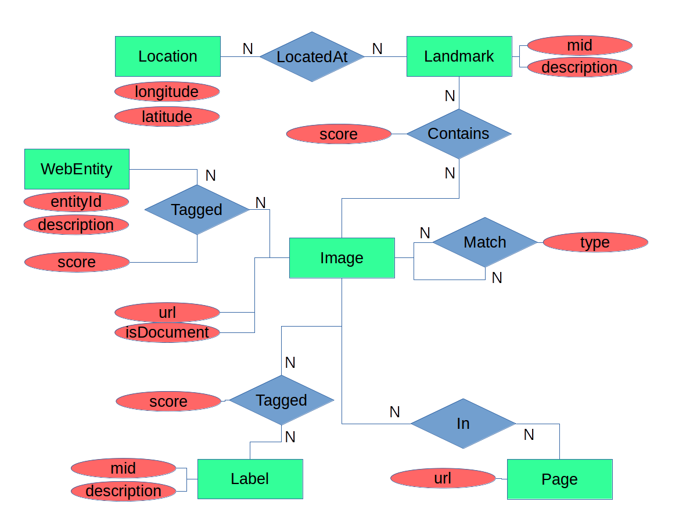

The project interacts with a set of JSON documents in Neo4j. 
The JSON documents are the output of the Google Cloud Vision API applied 
to images returned from a Flickr API query for interesting images related
to the text "New York".

## Introduction to the data

The annotations come from the Google Cloud Vision API and are described in
here https://cloud.google.com/vision/docs/reference/rest/v1/images/annotate#AnnotateImageResponse .

`'landmarkAnnotations' -- identify geographical landmarks in photographs. 
For the purposes of discussing entities in the database
schema, this will add 'Landmarks', each of which can have zero or more 'Locations'
 
 'labelAnnotations' -- predict descriptive labels for images. This will
   add 'Label' entities to the schema.
   
'webDetection' -- predict the presence of web entities (things with
   names) in images along with pages that contain the image and other
   images that are similar. This will add 'WebEntity', 'Page', and 'Image'
   entities to the schema.
   
## Introduction to code   

All of the python code is contained in the file [`project.py`] 
	* DB population from JSON files
	* DB queries

## Data Import

Importing JSON documents into Neo4j is rather complicated, but because of this, querying it is straightforward.  
The basic idea is that different sub-structures of a JSON document should be represented by different node types in the database and these will all be created at the same time using a single, combined query.

After importing the JSON into Neo4j, the total number of each label should be:

| Label | Count |
| ------ | -----:|
| image | 560 |
| label | 201 |
| page | 556 |
| landmark | 18 |
| location | 26 |
| webEntity | 451 |

## Code to query the database

1. Count the total number of JSON documents in the database
2. Count the total number of Images, Labels, Landmarks,
   Locations, Pages, and WebEntity's in the database.
3. List all of the Images that are associated with the
   Label with an id of "/m/015kr" (which has the description
   "bridge") ordered by the score of the association between them
   from highest to lowest
4. List the 10 most frequent WebEntitys that are applied
   to the same Images as the Label with an id of "/m/015kr" (which
   has the description "bridge"). List them in descending order of
   the number of times they appear, followed by their entityId
   alphabetically
5. Find Images associated with Landmarks that are not "New York"
   (id "/m/059rby") or "New York City" (id "/m/02nd ") ordered
   alphabetically by landmark description and then by image URL.
6. List the 10 Labels that have been applied to the most Images along with
   the number of Images each has been applied to
7. List the 10 Pages that are linked to the most Images through
   the webEntities.pagesWithMatchingImages JSON property along with
   the number of Images linked to each one. Sort them by count
   (descending) and then by page URL.
8. List the 10 pairs of Images that appear on the most Pages
   together through the webEntities.pagesWithMatchingImages JSON
   property. Order them by the number of pages that they appear on
   together (descending), then by the URL of the first. Make sure
   that each pair is only listed once regardless of which is first
   and which is second.
